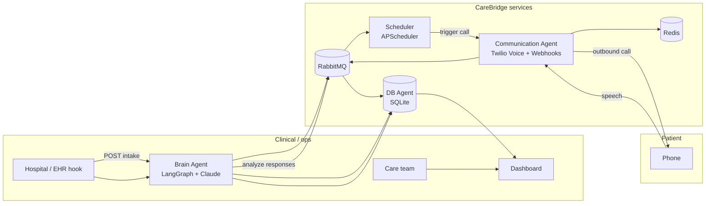

# CareBridge

Post-discharge follow-up platform that combines structured clinical data, AI-assisted workflows, and real-time voice outreach so care teams can stay close to patients without adding manual busywork.

---

## 1. Introduction

### The problem

Hospital discharge is a high-risk transition. Patients leave with dense instructions, new medications, and unclear red flags. Traditional “call us if anything changes” workflows break down when staff are stretched thin and patients are unsure what counts as urgent. Gaps in follow-up correlate with readmissions, avoidable complications, and poor experience.

**CareBridge** targets that gap by:

- **Structuring** discharge information (diagnosis, meds, risk signals).
- **Generating** condition-relevant follow-up questions automatically.
- **Reaching** patients through **scheduled, voice-based check-ins** (Twilio).
- **Interpreting** spoken answers with an LLM pipeline and surfacing **alerts** and **next steps** to the care team on a live dashboard.

### Who benefits

| Audience | How they benefit |
| -------- | ---------------- |
| **Patients & families** | Clear, guided check-ins after leaving the hospital; questions tailored to their condition; a simple phone experience without installing an app. |
| **Nurses & care coordinators** | A single view of who was contacted, what was said, and which responses triage as concerning—less phone-tag and manual scripting. |
| **Physicians & clinical leadership** | Better visibility into post-discharge trajectory; alerts tied to structured interactions rather than ad hoc messages. |
| **Health systems / innovation teams** | An event-driven, service-oriented reference stack they can extend (EHR hooks, policy layers, additional channels). |

### Empowering people—not replacing them

CareBridge is designed as **decision support and workflow automation**, not autonomous care:

- **Clinicians define the clinical context** through discharge documentation; the system does not invent diagnoses.
- **Risk and follow-up logic** produces **recommendations and alerts**; escalation paths remain under human policy.
- **Voice interactions** gather patient-reported outcomes in natural language; **interpretation** assists triage, while **acknowledgment, charting, and medical decisions** stay with licensed staff.
- The dashboard **amplifies attention** toward patients who may need outreach, instead of replacing the human relationship.

---

## 2. Core functionality & architecture

### Core features

| Area | What we built |
| ---- | ------------- |
| **Discharge intake** | API to submit discharge narrative; LangGraph + Claude extracts entities, assesses risk, proposes actions. |
| **Disease-aware questionnaires** | LLM-generated follow-up questions stored per patient and reused for outbound calls. |
| **Outbound voice follow-up** | Twilio outbound calls with TwiML; per-call Redis sessions; speech gather and turn-by-turn dialogue. |
| **AI interpretation of speech** | Spoken answers interpreted (Claude) with clarification prompts when needed; structured events published on the bus. |
| **Optional premium TTS** | ElevenLabs integration when `ELEVENLABS_API_KEY` is set; otherwise Amazon Polly via Twilio `<Say>`. |

### High-level architecture



**Conceptual event flow**

1. **Intake** — Discharge text → Brain parses, evaluates risk, generates questions → events → DB Agent persists → Scheduler may queue a follow-up.
2. **Follow-up** — Scheduler (or manual trigger) calls Communication Agent → Twilio places call → TwiML drives questions → speech → Brain analyzes → alerts / next scheduling when decision is not **stable**.
3. **Dashboard** — Frontend reads DB Agent (and related URLs) for patients, alerts, timeline, appointments.

> **Note:** The Communication Agent’s Twilio integration in this repository is **voice-centric** (webhooks under `/webhooks/voice/...`). Design your own SMS channel if you need text parity.

### Service map

| Service | Port | Role |
| ------- | ---- | ---- |
| **Brain Agent** | 8001 | LangGraph + Claude: intake, risk, questionnaires, response analysis, decisions. |
| **Communication Agent** | 8002 | Twilio voice, webhooks, Redis call sessions, optional ElevenLabs TTS in TwiML. |
| **DB Agent** | 8003 | SQLite access (single writer), REST CRUD, demo seed, migrations target. |
| **Scheduler** | 8004 | Scheduled jobs, manual `POST /trigger/{patient_id}`, RabbitMQ consumers as configured. |
| **Frontend** | 3000 | Next.js dashboard (`NEXT_PUBLIC_*` URLs point at published API ports). |
| **RabbitMQ** | 5672 (AMQP), 15672 (management UI) | Message broker. |
| **Redis** | 6379 | Cache / voice sessions. |

### Follow-up timing (demo vs production)

- **`DEMO_MODE=true`** (default): Short delays for hackathon-style demos; Brain can emit follow-up schedules with minute-scale offsets; scheduler fallback uses `DEMO_FOLLOWUP_DELAY_SECONDS` when needed.
- **`DEMO_MODE=false`**: Scheduler respects wall-clock **`scheduled_at`** on events.

After schema changes, run **`uv run alembic upgrade head`** (host) or ensure your Docker entrypoint runs migrations so tables like **`followup_jobs`** (with `correlation_id`, etc.) exist.

---

## 3. Technical setup

### 3.1 Prerequisites

**For Docker (recommended full stack)**

- [Docker Desktop](https://www.docker.com/products/docker-desktop/) (or Docker Engine + Compose v2) with enough RAM for RabbitMQ + multiple Python services + Next build.
- **Anthropic** API key ([Console](https://console.anthropic.com/)).
- **Twilio** account: Account SID, Auth Token, a **voice-capable** phone number.
- **Public HTTPS URL for webhooks** — for local dev, [ngrok](https://ngrok.com/) (or similar) exposing host port **8002**.
- *(Optional)* **ElevenLabs** API key and voice ID for richer TTS (see `.env.example`).

**For local (non-Docker) development**

- **Python 3.12+** and **[uv](https://github.com/astral-sh/uv)**.
- **Node.js 22+** and npm.
- **RabbitMQ** and **Redis** running locally (or point env vars to remote instances).
- Same API keys as above.

### 3.2 Environment file

```bash
cp .env.example .env
```

Edit **`.env`** minimally:

| Variable | Purpose |
| -------- | ------- |
| `ANTHROPIC_API_KEY` | Claude (Brain Agent). |
| `TWILIO_ACCOUNT_SID`, `TWILIO_AUTH_TOKEN`, `TWILIO_PHONE_NUMBER` | Outbound voice + webhooks. |
| `TWILIO_WEBHOOK_BASE_URL` | **HTTPS origin only**, no path, e.g. `https://abc-xyz.ngrok-free.app` — must match your tunnel to **port 8002**. |
| `ELEVENLABS_API_KEY`, `ELEVENLABS_VOICE_ID` | Optional TTS upgrade. |
| `DEMO_MODE` | `true` for short demo delays (default). |

Compose overrides infra URLs inside containers (`RABBITMQ_URL`, `REDIS_URL`, `DATABASE_URL`, service base URLs). You still need **`.env`** for secrets and `TWILIO_WEBHOOK_BASE_URL`.

### 3.3 Run the full stack with Docker

From the **repository root**:

```bash
docker compose up --build
```

From **`infra/`**, you can run `docker compose -f docker-compose.yml up --build` — that file **includes** the root `docker-compose.yml`.

**What starts (each component):**

| Step | Component | What happens |
| ---- | --------- | ------------ |
| 1 | **Network** | Compose creates a bridge network; services resolve each other by name (`rabbitmq`, `redis`, `db_agent`, …). |
| 2 | **RabbitMQ** | Broker on `5672`; management UI on **http://localhost:15672** (guest/guest). Health: AMQP listener ready. |
| 3 | **Redis** | Cache on `6379`; health: `PING`. |
| 4 | **DB Agent** | Builds from `infra/Dockerfile`; mounts volume **`sqlite_data`** → `/app/data/carebridge.db`; runs API on **8003**; seeds **five demo patients** on first empty DB unless `SKIP_DEMO_SEED=1`. |
| 5 | **Brain Agent** | Waits for RabbitMQ + healthy `db_agent`; LangGraph + Claude on **8001**. |
| 6 | **Communication Agent** | Waits for Redis, DB, Brain; Twilio + voice webhooks on **8002**. |
| 7 | **Scheduler** | Waits for DB + Communication Agent; **8004**. |
| 8 | **Frontend** | Next.js production image; **3000**; env points browser to `localhost:8001/8003/8004`. |

**URLs (host machine):**

- Dashboard: **http://localhost:3000**
- Brain: http://localhost:8001/health  
- Communication: http://localhost:8002/health  
- DB Agent: http://localhost:8003/health  
- Scheduler: http://localhost:8004/health  

**SQLite persistence:** Data lives in Docker volume `sqlite_data` (e.g. named `carebridge_sqlite_data`). Only **db_agent** mounts it—do not attach the same SQLite file to multiple writers.

**Reset demo data:**  
`docker compose down` then `docker volume rm carebridge_sqlite_data` (name may vary; use `docker volume ls`) and `docker compose up --build` again.

**Included compose profile — tooling:** run the scripted demo **inside** the Compose network:

```bash
docker compose --profile tooling run --rm tooling
```

This executes `scripts/demo_flow.py` with internal service hostnames.

### 3.4 Twilio voice & ngrok (mandatory for real calls)

Twilio’s cloud fetches TwiML over **HTTPS** from the **public internet**. Inside Compose, `http://communication_agent:8002` is **not** valid for `TWILIO_WEBHOOK_BASE_URL`.

1. Start the stack so port **8002** is published on the host: `docker compose up --build`.
2. On the **host**, tunnel to Communication Agent:  
   `ngrok http 8002`
3. Copy the **HTTPS** forwarding URL (origin only, no path).
4. Set `TWILIO_WEBHOOK_BASE_URL` in **`.env`** to that origin; restart Communication Agent (e.g. `docker compose up -d communication_agent scheduler`).
5. Verify TwiML (from repo root, with `.env` loaded):

   ```bash
   uv run python scripts/check_twilio_tunnel.py
   ```

   Or manually:

   ```bash
   curl -sS -o /dev/null -w "%{http_code}\n" "https://YOUR_SUBDOMAIN.ngrok-free.app/webhooks/voice/twiml-smoke"
   ```

   Expect **200** and XML containing `<Response>`.

**Common mistakes:** ngrok pointing at **3000** (frontend) instead of **8002**; stale ngrok URL after restart; extra **path** in `TWILIO_WEBHOOK_BASE_URL` (must be `https://host` only).

### 3.5 Local development (without Docker)

Use separate terminals or a process manager:

```bash
# 0. Python env
uv venv --python 3.12 && source .venv/bin/activate
uv pip install -e "."

# 1. Migrations
alembic upgrade head

# 2. Infrastructure
brew services start rabbitmq   # or your OS equivalent
brew services start redis

# 3. ngrok (for Twilio)
ngrok http 8002

# 4. Services (example ports)
uv run uvicorn services.db_agent.main:app --port 8003 --reload
uv run uvicorn services.brain_agent.main:app --port 8001 --reload
uv run uvicorn services.communication_agent.main:app --port 8002 --reload
uv run uvicorn services.scheduler.main:app --port 8004 --reload

# 5. Frontend
cd frontend/nextjs-dashboard && npm install && npm run dev
```

Point **`.env`** at `localhost` URLs (see `.env.example` comments for `BRAIN_AGENT_URL`, etc.).

### 3.6 Useful scripts (host against Docker or local)

```bash
uv run python scripts/demo_flow.py          # Intake + wait + trigger voice path
uv run python scripts/trigger_followup.py <patient_id>
uv run python scripts/seed_data.py          # Sample discharge to Brain
```

Override bases if needed: `BRAIN_AGENT_URL`, `COMM_AGENT_URL`, `DB_AGENT_URL`, `SCHEDULER_URL`, `FRONTEND_URL`.

### 3.7 Demo checklist (quick)

1. `docker compose up --build` — wait for **healthy** containers.
2. Open **http://localhost:3000** — confirm seeded patients (e.g. ward table IDs match DB).
3. Run `uv run python scripts/demo_flow.py` **or** `POST http://localhost:8004/trigger/<patient_id>`.
4. Ensure ngrok + `TWILIO_WEBHOOK_BASE_URL` for a real handset test.

### 3.8 API reference (summary)

**Brain (`:8001`)** — `POST /intake`, `POST /evaluate-response`, `GET /patients/{id}/questions`, `GET /health`.

**Communication (`:8002`)** — `POST /initiate-call` (optional `schedule_correlation_id`), voice webhooks under `/webhooks/voice/*`, `GET /active-sessions`, `GET /health`.

**DB Agent (`:8003`)** — `GET /patients`, `GET /patients/{id}`, `POST /patients/{id}/schedule-followup`, `GET /alerts`, `PATCH /alerts/{id}/acknowledge`, `GET /followup-jobs`, `PATCH /followup-jobs/by-correlation/{correlation_id}`, `GET /patients/{id}/timeline`, `GET /patients/{id}/questionnaire`, `GET /health`.

**Scheduler (`:8004`)** — `GET /jobs`, `POST /trigger/{patient_id}`, `GET /health`.

### 3.9 Tech stack

- Python **3.12**, **FastAPI**, **LangGraph**, **Anthropic Claude**, **Twilio**, **aio-pika** (RabbitMQ), **Redis**, **SQLite** + **SQLAlchemy 2** + **Alembic**, **structlog**, **uv**.
- Frontend: **Next.js** (App Router), **TypeScript**, **Tailwind**, **shadcn/ui**.

### 3.10 Production notes

- **SQLite** implies a **single** DB Agent instance with the data volume; for horizontal scale or HA, migrate to **PostgreSQL** (or similar) and update `DATABASE_URL`.
- Lock down **Twilio** webhook URLs, **rotate** keys, and enforce **HTTPS** only.
- Add **authn/z** on public APIs and the dashboard before exposing beyond demos.

## 4. Collaborators

Add your team here:

| Name | Email |
|------|-------|
| Dev Patel | entrepreneurdev1901@gmail.com |
| Ananya Vashist | ananya.vashist21@gmail.com |
| Abhishek Sutaria | abhishek.sutaria@gmail.com |
| Neel Shah | shahneelsachin@gmail.com |
